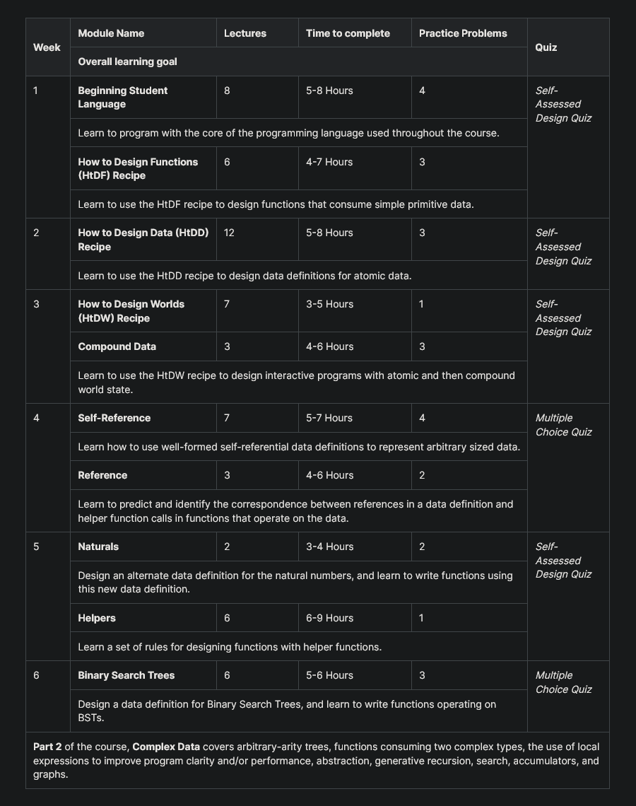

# How to Code - Simple Data

Course links:

- [How to Code: Simple Data](https://learning.edx.org/course/course-v1:UBCx+HtC1x+2T2017/home)
- [Systematic Program Design](https://www.youtube.com/channel/UC7dEjIUwSxSNcW4PqNRQW8w/playlists)

Question and Quiz Problems:

- [Question and Quiz Problems (from spamegg1)](https://github.com/spamegg1/reviews/tree/master/courses/HowToCodeSimple)

Syllabus:

