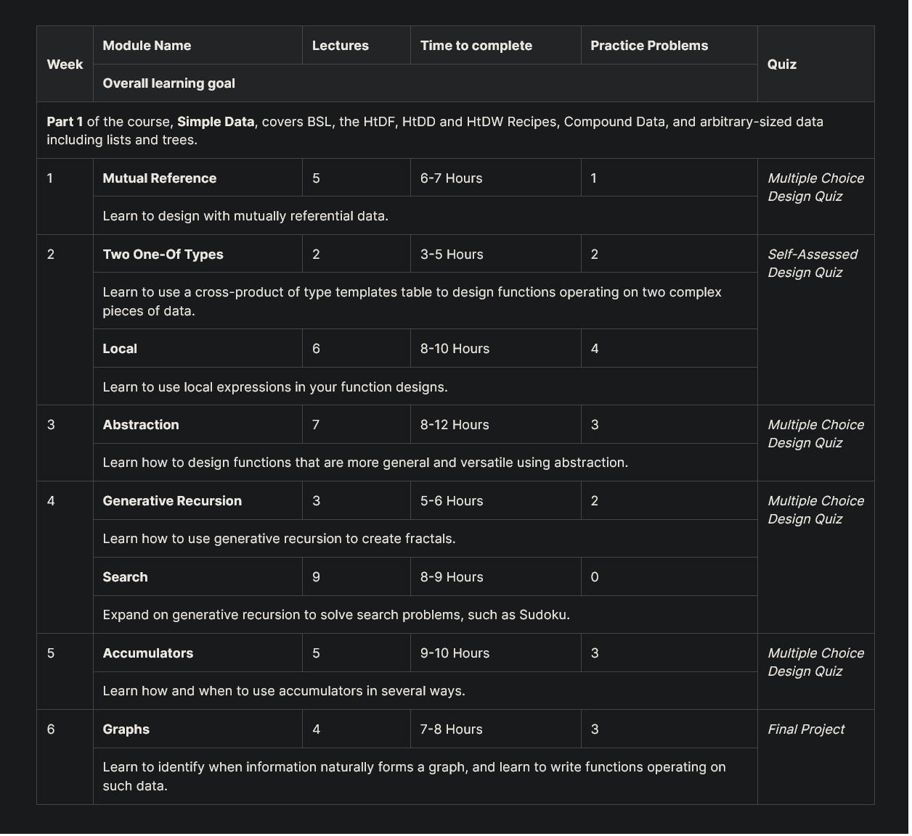

# How to Code - Complex Data

Course links:

- https://learning.edx.org/course/course-v1:UBCx+HtC2x+2T2017/home
- https://www.youtube.com/channel/UC7dEjIUwSxSNcW4PqNRQW8w/playlists

Question and Quiz Problems:

- https://github.com/spamegg1/reviews/tree/master/courses/HowToCodeComplex

Syllabus:

