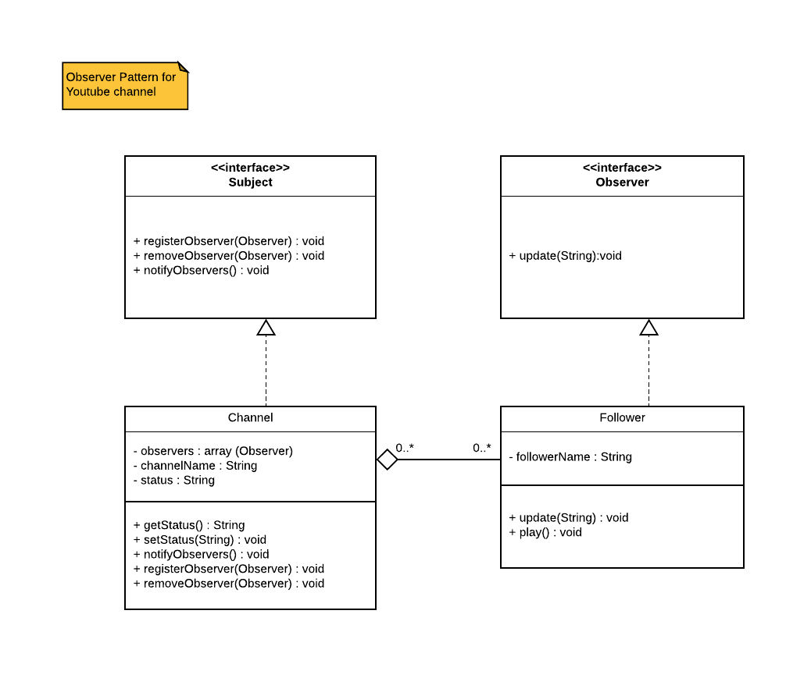

# Observer pattern

## Description

Youtube allows users to follow their favorite Youtube stars so that they will be notified when the channel is live. This is commonly done using the observer pattern. Complete the provided code and use the following UML class diagram as a guide:

## UML



## Code

Subject.java

```java
public interface Subject {
    public void registerObserver(Observer observer);
    public void removeObserver(Observer observer);
    public void notifyObservers();
}
```

Channel.java

```java
public class Channel implements Subject {
    private ArrayList<Observer> observers = new ArrayList<Observer>();
    private String channelName;
    private String status;

    public String getStatus() {
        return this.status;
    }
    public void setStatus(String status) {
        this.status = status;
    }
    public void registerObserver(Observer observer) {
        this.observers.add(observer);
    }
    public void removeObserver(Observer observer) {
        this.observers.remove(observer);
    }
    public void notifyObservers() {
        for (int i = 0; i < this.observers.length; i++) {
            this.observers[i].update(this.status);
        }
    }
}
```

Observer.java

```java

public interface Observer {
    public void update(String status);
}
```

Follower.java

```java
public class Follower implements Observer {
    private String followerName;

    public void update(String status) {
        System.out.println("Notify update");
    }
    public void play() {
        System.out.println("Playing videos");
    }
}
```
